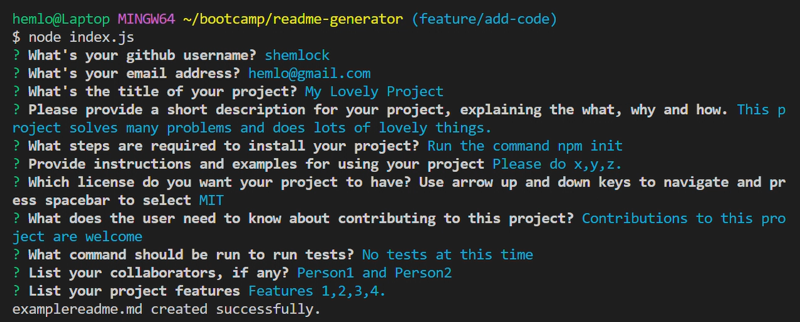

# README Generator

## Description

README Generator is a command-line application that dynamically generates a professional README.md file from a user's input. 

The image above illustrates an example README.md file that was generated for a Movie Website Project, using the README Generator. 

The motivation for this project was to enable users to quickly and easily create a README file for their project. 

README Generator helps to solve the problem of inefficent workflow. Creating README.md files is a time-consuming task, by using this command line application, users can spend less time on writing the README and devote more time to working on other aspects of their projects. 

Building this project helped me learn more about: 
* Node.js
* The Inquirer Package
* The fs module
* README.md files
* Creating prompts
* Handling user inputs
* Generating license badges

## Table of Contents 

- [Installation](#installation)
- [Usage](#usage)
- [Credits](#credits)
- [License](#license)

## Installation

To invoke this application, please download the files then in the terminal write < node index.js > then press enter. 

## Usage

After invoking the application, you as a user will be presented with 9 questions, as seen in the example below.

* Please note questions are in white, user input is in blue. 
* To answer just type what you would like to say then press enter. 
* If you see questions that have something in brackets after, as seen in the image below, this is a default answer. 
* If you would like to select the default answer please just press enter. If you do not want the default answer you can overwrite it by just typing whatever you like. 

* If you see a question than has a checkbox, as seen in the image below. 
* Please use the up and down arrow keys to go through the options, then press spacebar to select an option. 
* After pressing spacebar to select you should see a little asterisk next to your chosen option. If you are happy with this selection then press enter. 

After answering all the questions, you should see a 'examplereadme.md creating successfully' message. 

Now when you go to your files you will see that a 'examplereadme.md' file has been created, as shown below. 

If you open it it will look something like the image below. 

Then if you right click on the tab and press open preview, you will be able to see what it looks like as a README.md file, as shown below. 

## Credits

N/A

## License

MIT

## Features

* Prompts users with Questions
* Generates a README file based on their input. 

## Tests
N/A
